Phone Assembly Tutorial
===============

A simple subassembly task using the FreeCAD Assembly 4 Workbench
----------------

Our phone will be a very simple design, with a rectangular frame, a screen, and two identical cameras:

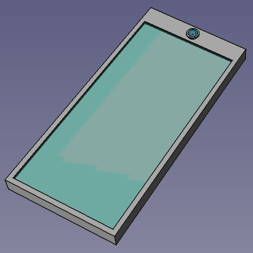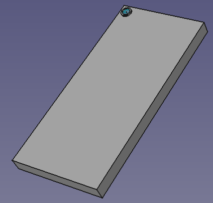

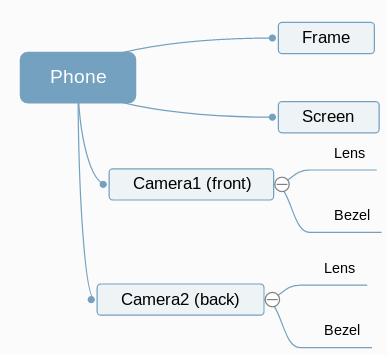

During the tutorial, we will create the following files:

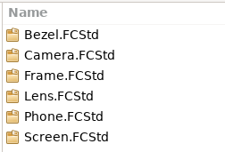

Two of these are assembly files, as the camera will be included as a sub-assembly in the phone in two different places, front and rear.  Assemblies, sub-assemblies and parts are handled in exactly the same way.

Saving the components in separate files allows them to be worked on by different engineers. Each will have a clearly defined interface to the other documents, allowing easy interchange of different or upgraded designs for modular components.

Setup:
===========
We need a recent version of FreeCAD (at least 0.19).
Under Tools -> Addon manager, install the Assembly4 Workbench:

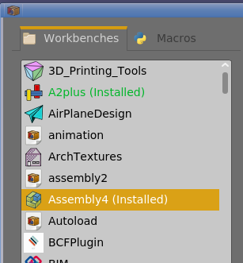

----------------------------

Create the frame:
=========================

From the start page of FreeCAD, select "Create new..."

Save the file in your selected directory as "*Frame*"

Choose the Assembly 4 workbench  and insert a new Assembly4 Model: 

This will give us a new model in the tree:

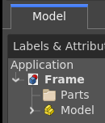

Create a new Body: 

This will be inserted under Parts in the tree:

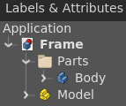

Move the parts folder into the Model in the tree.  This simplifies later steps when choosing what to include in our assembly.

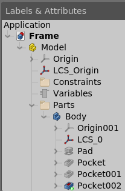

Now we are ready to model the frame.
In this case, it will be a simple rectangular pad with pockets for the screen and two cameras.

Right-click on the Body in the tree and select "Toggle active Body".
This will open the Part Design workbench.

Create a new sketch:

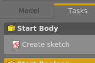

Select the XY Plane:

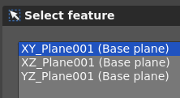

and click OK.

Create a rectangle 145x70mm:

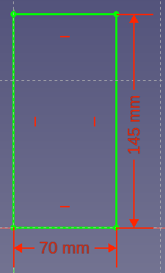

Press Escape, or the close button on the Tasks tab to close the sketch.

Pad the sketch to create the frame of the phone:

Leave the default 10mm and click OK.
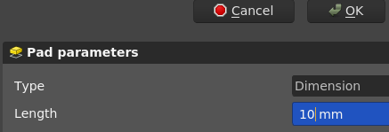

Click the top face of the phone frame, then the "Create a new sketch" button. 

Set the dimensions of the screen as follows:
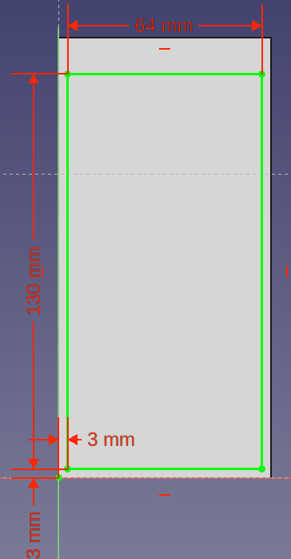

**Note:** Good engineering practice would reference these dimensions from a spreadsheet to enable rapid design upgrades or different phone sizes from the same design.

Press Escape or Close to exit the sketch, and then create a pocket 

Make the pocket 2mm deep.

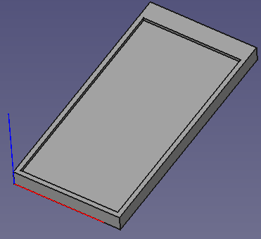

Open a new sketch on the top of the phone for the front camera cutout, and create a circle with the following dimensions:

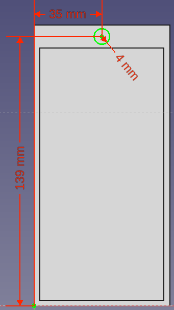

As before, create a pocket, this time 4mm deep:

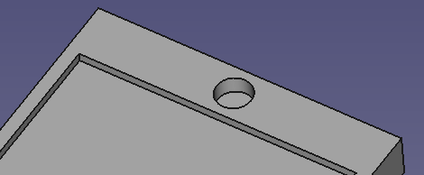

Flip the phone frame over, and repeat for the rear-facing camera:

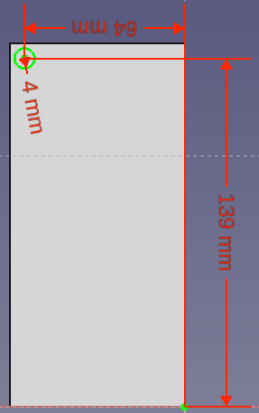

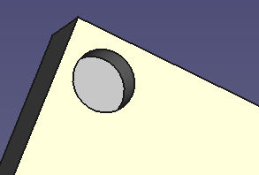

The frame design is now complete, but we need some local co-ordinate systems to allow assembly of the components to the frame in the correct places.

Create a Local Co-ordinate System for the Screen
-------------------

Switch back to Assembly 4 workbench. 

This is the heart of Assembly 4.  We will add the Local Co-ordinate Systems to the frame in the positions and orientations for the sub-assembly parts to attach correctly to the frame.

First, we will create an LCS to attach the screen in the corner of the frame. Click "Create a new co-ordinate system in part"

Call it LCSScreen:

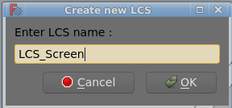

Right-click on the new LCS in the tree

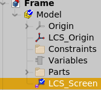

and select "Edit datum".

Highlight "XY tangent to surface"

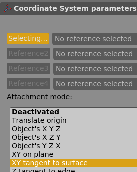

Zoom in on the bottom left corner of the frame, and select the base plane of the pocket created earlier.

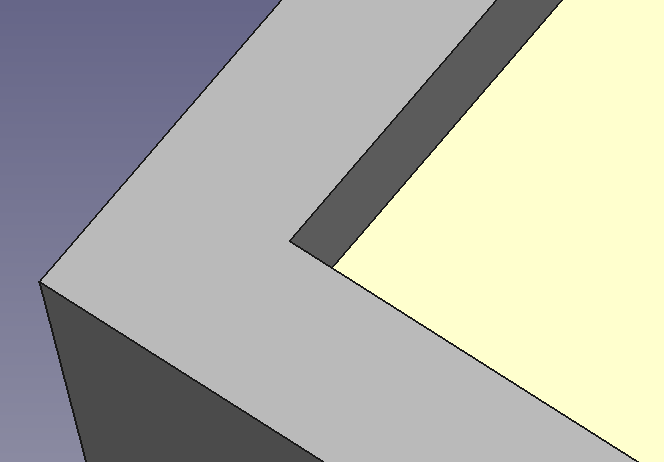

Next, click exactly in the corner of the pocket to select the vertex that will lock in the X and Y for this datum:

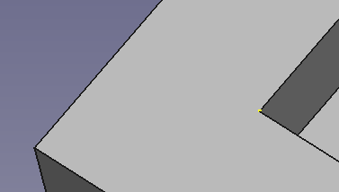

Note the small yellow dot in the image above.

We now have an LCS positioned correctly, but it is facing out from the corner, so we need to rotate it.

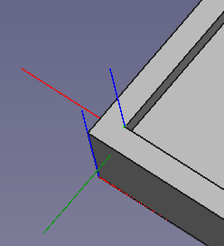

In the bottom of the dialogue, change "Around z-axis" to 180&deg;:

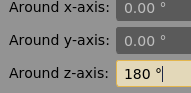

The LCS is now correctly oriented for the screen to attach.

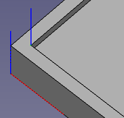

Click OK at the top of the dialogue and move to the front camera position.

Create a Local Co-ordinate System for the front camera assembly
-------------------

Click "Create a new co-ordinate system in part"

Name it LCSFrontCamera.

Right-click on the new LCS in the tree and select "Edit datum".

Select the bottom circumference of the front camera pocket (yellow line in this picture):

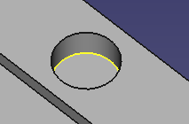

Click OK.

That's it.  We don't need to consider rotation in this case, and the module has automatically selected "concentric" as the constraint type.

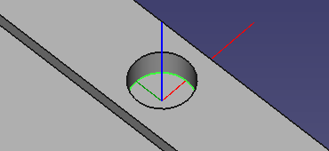

Create a Local Co-ordinate System for the front camera assembly
-------------------

Repeat the exercise above for the rear camera:

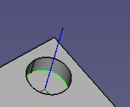

---------------

Create the screen:
==================
Create a new part and save it as *Screen*

Create a new Assembly 4 model. 

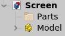

Move Parts folder under Model in tree:

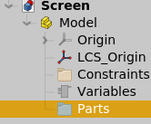

Create a new body. 

This will add the body in a Parts folder in the tree. Right-click on the Body and select "Toggle active body" to open the Part Design workbench.

Create a new sketch on the XY plane with a simple rectangle:  

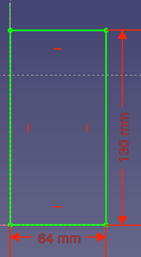

Note that the corner of the sketch is co-incident with the origin.  This will align later with the LCS that we created above.

Exit the sketch, then create a pad  1mm vertically.

Right-click on the Body, then change the appearance to 70% transparency, and a blue-ish colour.

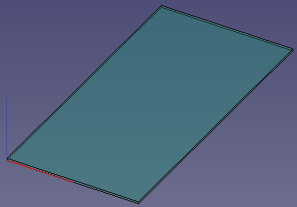

Save the Screen file.

------------------

Create the camera bezel:
================

Create a new part and save it as *Bezel*

Create a new Assembly 4 model. 

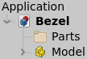

Move Parts folder under Model in tree:

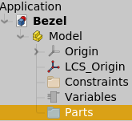

Create a new body. 

This will add the body in a Parts folder in the tree. Right-click on the Body and select "Toggle active body" to open the Part Design workbench.

Create a new sketch on the XY plane with two concentric circles 8mm and 3mm diameter:  

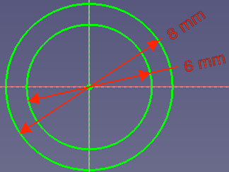

Exit the sketch, then pad  5mm vertically.

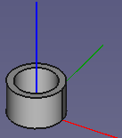

--------------

Create a Local Co-ordinate System for the front camera assembly
-------------------

We now need to insert a Local Co-ordinate System to attach the lens when we create the *Camera* sub-assembly.
The lens will be positioned near the top of the bezel.

Click "Create a new co-ordinate system in part"

Name it LCS\_LensAttachment:

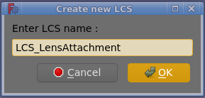

Right-click on the new LCS in the tree

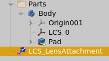
and select "Edit datum".
Select the top circumference to place the datum at the top of the bezel.
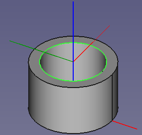

To protect the lens, we need to drop it 1mm below the top of the bezel.  Change "In z-direction" to -1 mm:

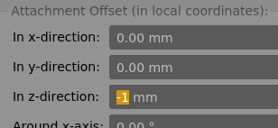

This drops the LCS as shown:

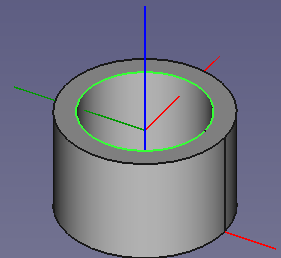

Save the part.

--------------------

Create the camera lens:
================
Open a new file, and save as *Lens*.
Create a spherical lens starting with the following sketch on the XZ Plane:
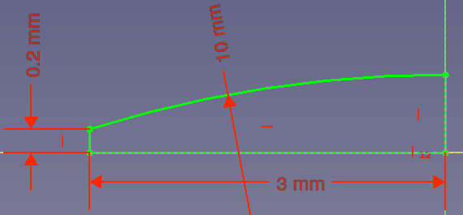
Note that the cetre of the radius must be constrained vertically to the origin for a tangential top surface.
The exact dimensions are not important for this exercise.

Revolve  the sketch 360&deg;, then mirror
  the Revolution feature to create a double-sided lens something like this:
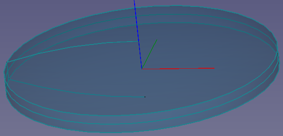

You can adjust colours and transparency if you like.

For this component, we have modelled with the origin at the centre of mass, so we don't need to add an extra Local Co-ordinate System.

Our lens model tree should now look something like this:

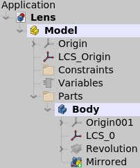

----------------------

Create the camera sub-assembly:
===============================
Create a new file, and save it as *Camera*.

Create a new Assembly 4 model. 

Insert a link to the *Bezel* part , keeping the default name *Bezel*, since there will be only one instance of it in this sub-assembly.

Select "Parent Assembly" on the right-hand side of the dialogue.
Select "LCS_Origin" on both sides of the dialogue:

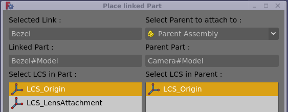

This will place the bezel at the origin of the sub-assembly.

Now insert the *Lens* into the *Bezel*  in the same way, except in this case, we will attach it to the LCS created earlier.
Select "Bezel" on the right-hand side of the dialogue this time, and "LCS_LensAttachment" in the parent:

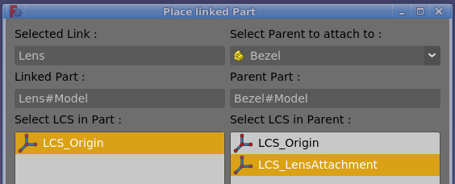

The lens is now positioned with it's origin 1mm below the top of the bezel:

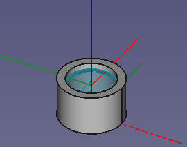

Save the camera sub-assembly.

--------------------------

Create the phone assembly:
=========================
Create a new file, and save it as *Phone*.

Create a new Assembly 4 model. 

Insert a link to the *Frame* part , keeping the default name *Frame*, since there will be only one instance of it in this assembly.

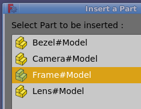

Select "LCS\_Origin" for both sides:

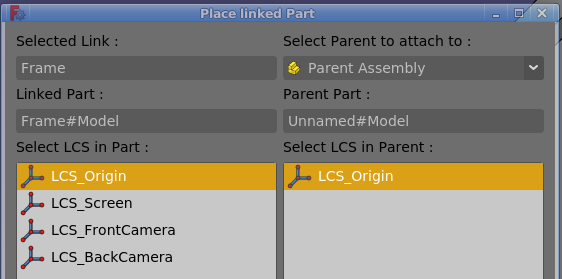

Insert a link to the *Screen* part , keeping the default name *Screen*, since there will be only one instance of it in this assembly.

Select "LCS\_Origin" for the Screen, and "LCS\_Screen" for the co-ordinate system in the frame.
Because we aligned the LCS in the *Frame* file, it positions correctly without any rotation:

------------------

Now we can insert two instances of the *Camera* sub-assembly.

As above, insert a link to the *Camera* part , but this time, **Change** the name to *CameraFront*, since there will be two instances of it in the phone assembly.

Choose "LCS\_Origin" for the camera, which is located at the base of the sub-assembly, and "LCS\_FrontCamera" for the inserted part.

Repeat for the rear camera, this time naming it to "CameraRear" and selecting "LCS\_RearCamera" as the attachment point on the frame.

